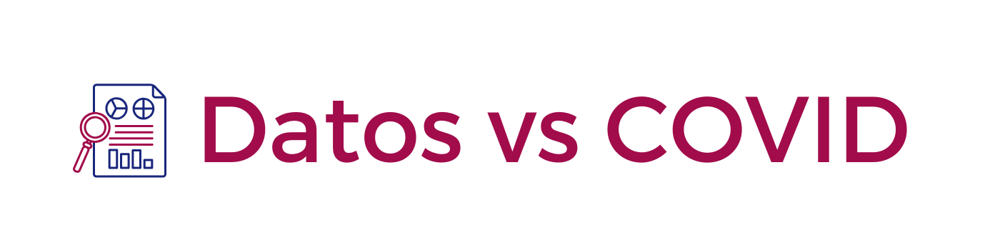

<p align="center">
<br>
<a href="https://datosvscovid.github.io/" target="_blank"></a>
<a href="http://datosvscovid.slack.com/" target="_blank"></a>
</p>


# Eventos globales

**tl;dr:** Plataforma que alberga los proyectos de la comunidad Datos vs COVID.


## Tabla de contenidos

- [Acerca del proyecto](#acerca-del-proyecto)
- [Contribuye](#contribuye)
- [Atribuciones](#atribuciones)


## Acerca del proyecto


## Contribuye


### Añade un evento


### Modifica el sitio

Por favor abre un issue donde menciones los cambios que te gustaría agregar y menciona a **@Chekos**. En dado caso, se te asignaría el issue y esperaremos tu PR donde te pediremos solicites una revisión a **@Chekos** para revisar y aceptar tus cambios al sitio.

Si deseas correr el sitio de manera local, ejecuta los siguientes pasos:

1. Instala los requerimientos:
   ```bash
   bundle install
   ```

2. Corre el servidor:
   ```bash
   bundle exec jekyll serve
   ```

3. Abre <http://localhost:4000/eventos-globales> en tu navegador.

El comando del paso 2 te permite hacer modificaciones y visualizar los cambios en tiempo real dentro de tu localhost.


## Atribuciones

- Sitio basado en el de [Codeando Mexico: Eventos Globales](https://codeandomexico.github.io/eventos-globales/)
- Sitio web basado en [Pintereso Jekyll Theme](https://www.wowthemes.net/pintereso-free-bootstrap-jekyll-theme/)
- Gracias a [Richard](https://github.com/ricardomiron) y [Rodo](https://github.com/RodolfoFerro) por las contribuciones iniciales
- `{}` y contenidos con ❤️ por la [comunidad de Codeando México](http://slack.codeandomexico.org/)

---

Este sitio cuenta con una licencia MIT.
